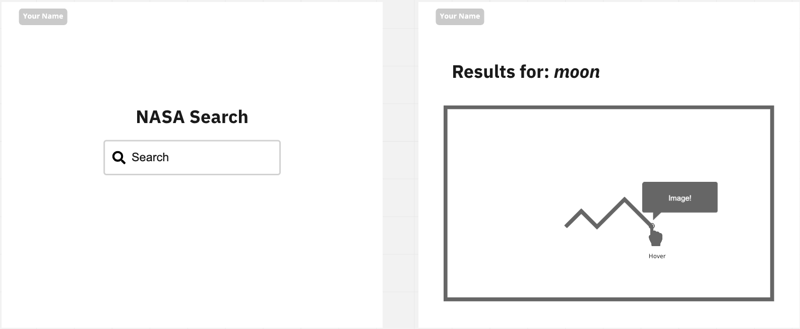

# Front End Technical Challenge

## Brief

We would like you to develop a web application that integrates with the [NASA Image Library API](https://images.nasa.gov/). It should allow users to **search for assets** and then show the assets organized by date in a [Area Chart](https://recharts.org/en-US/examples/SimpleAreaChart). It should allow users to see the image in the tooltip when they hover the dots. You can group and consider just one image/result per date.

The following wireframes show a high-level representation of the content and user flow:



## API

### Example Usage

```js
q => fetch(`https://images-api.nasa.gov/search?&media_type=image&q=${q}`);
```

### Docs

- https://images.nasa.gov/docs/images.nasa.gov_api_docs.pdf
- https://images.nasa.gov (website)

## Tools, libraries and frameworks

We would like you to use [NextJs](https://nextjs.org/learn/basics/create-nextjs-app/setup) and [Recharts](https://recharts.org/en-US). 

We will run your app in an up-to-date version of Chrome, however, keep in mind it should be compatible with all modern browsers.

## Assessment

We will assess the task based on the following criteria:

- How clean, modular and extensible the code is
- Suitability of tools, libraries and frameworks used (for the app and any build processes)
- How it looks visually and the techniques used to style the application
- Responsive web design techniques used and the approach used for layout and accessibility
- Testing
- Anything above and beyond e.g. loadings, animation, routing, video playback etc.
